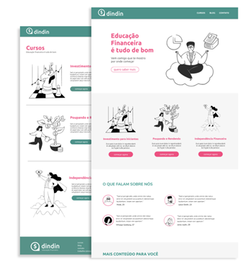
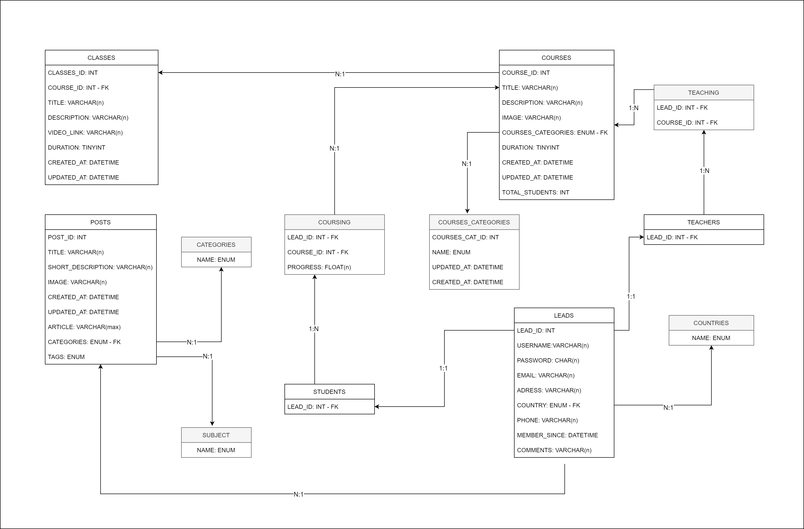

# <pra.elas> Grupo Meraki Girls

Projeto desenvolvido para a Gama Academy em parceria com o Banco BV.

Desenvolvimento de uma plataforma de conteúdo sobre Educação Financeira (HTML + CSS) para a empresa fictícia 'dindin' a partir do design fornecido (Figma), com a utilização de metodologias ágeis durante a organização e execução do projeto.

## Integrantes:

>  Lawrence Maria Galdino da Silva \
Leticia Cristina da Silva \
Liliane Silva de Almeida \
Thays Santos Motta Guerreiro 

## O Desafio
---

*''A empresa fictícia DINDIN, quer lançar uma plataforma de conteúdo sobre Educação Financeira e vocês foram contratadas como desenvolvedoras!''*

        

### ENTREGAS MÍNIMAS
1.	Metodologias Ágeis:
    -	Kanban com todas as tarefas organizadas e responsáveis definidos.
2.	Front-end:
    - Código entregue no Github.
    - Páginas publicadas no Github Pages.
3.	Banco de Dados:
    - MER para o banco de dados pode ser entregue como imagem junto ao repositório no Github.

### CRITÉRIOS DE AVALIAÇÃO

-	As páginas devem ser responsivas.
-	Os links devem permitir a navegação entre as páginas.
-	O banco de dados deve ser entregue como um MER.
-	O site deve ser disponibilizado no Github Pages.

## Desenvolvimento

 O site Dindin foi desenvolvido em HTLM + CSS, a partir do layout oferecido, atendendo os requisitos de responsividade para Desktop, Tablets e Smartphones.

## O site

Página disponivel em: <a href= "https://merakigirlsbv.github.io/site-dindin-v2/"> Site Dindin </a>
Página disponivel em: <a href= "https://unruffled-borg-41ce41.netlify.app/"> Site Dindin </a>

## Modelo Entidade Relacionamento (MER)

O MER estabelece relacionamento entre os elementos do site e a organização do banco de dados, o diagrama abaixo foi criado priorizando informações sobre cursos, posts do blog e depoimentos de leads.
Considerando que se trata de uma plataforma de aulas online, também verificamos a necessidade do controle de informações de cadastro dos alunos, aulas em que estão matriculados e seu progresso no curso. 

        
          <a href= "https://viewer.diagrams.net/?tags=%7B%7D&target=blank&highlight=999999&edit=_blank&layers=1&nav=1&title=Untitled%20Diagram.drawio#Uhttps%3A%2F%2Fdrive.google.com%2Fuc%3Fid%3D1eGzFR5k-5BrPXM_EiSq4cIz4g6IACrh9%26export%3Ddownload"> Link MER </a>
    

## Metodologia Ágil - Kanban

A organização do grupo foi feita através do método Kanban, pela utilização de cards na plataforma "Trello". Inicialmente foi definido um Backlog e a partir dele o grupo designou as tarefas para cada integrante e seguiu com as etapas: To Do, Doing, Code Review, Testing e Done. 

Para acompanhar o board no Trello, acesse o site: <a href= "https://trello.com/b/MG4a5lm9"> Kanban </a>

## Links Úteis

Encontre todos os links relacionados ao projeto <a href= "https://linktr.ee/MerakiGirlsBV"> aqui. 
